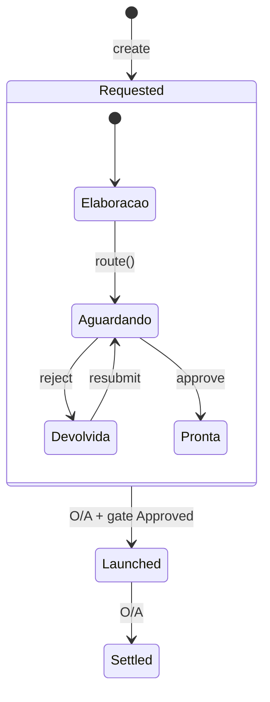
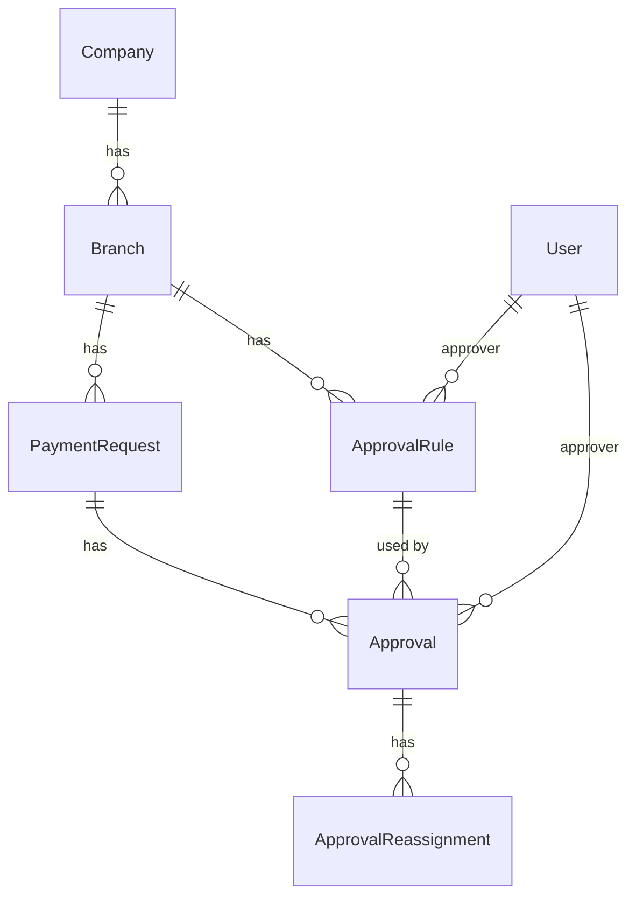
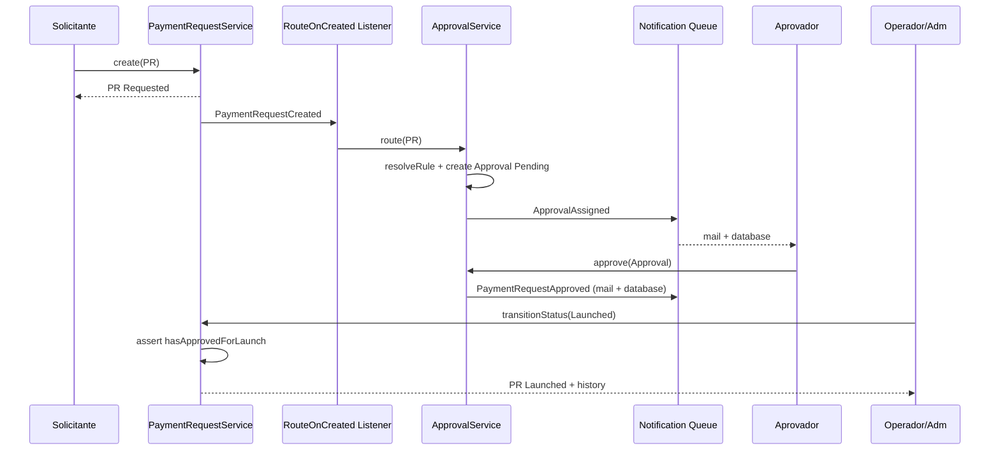

# Arquitetura: Fase 4 — Workflow com alçadas

> **Escopo:** RF019–RF024 (ApprovalRule por filial/faixa, roteamento automático, notificação ao aprovador, rejeição com devolução, entidade Approval + ApprovalStatus, SLA por Company com escalação).
> **Fora de escopo:** Fases 5–8 (import lote, lote anexos, CNAB, dashboard/relatórios). Apenas hooks documentados.
> **Stack:** Laravel 12 · Filament 5 · PHP 8.4 · Pest 4 · Livewire 4 · PostgreSQL · Redis (cache/filas).
> **Fonte:** [.ai/requisitos/drf-financeiro-v1.md](../requisitos/drf-financeiro-v1.md) · alinhamento [.ai/arquitetura/fase-1-base.md](fase-1-base.md) · [.ai/arquitetura/fase-2-cadastros-gerenciais.md](fase-2-cadastros-gerenciais.md) · [.ai/arquitetura/fase-3-solicitacao-ocr.md](fase-3-solicitacao-ocr.md)
> **Autor:** architect (subagent · Cursor Grok 4.5 High)
> **Data:** 2026-08-05 · **Atualizado:** 2026-08-12 (revisão DBA §25)
> **Status:** Pendências BA **fechadas** (§20); revisão **`dba` concluída em 2026-08-12** (Aprovado com ressalvas) — pronto para `/blueprint` ou `implementer`.

---

## 1. Contexto

As Fases 1–3 entregaram:

| Capacidade | Origem |
|------------|--------|
| `User.can_approve` + `scopeApprovers` + `UserRole` | F1 |
| `Company` como âncora multi-tenant BPO; SLA **adiado** na F1 → agora `approval_sla_business_days` | F1 § decisão · BA #2 |
| Cadastros gerenciais + Policies/`scopeVisibleTo` | F2 |
| `PaymentRequest` + `PaymentRequestStatus` (`Requested` → `Launched` → `Settled`) + `canTransitionTo` | F3 |
| `PaymentRequestService::transitionStatus()` + histórico + events `PaymentRequestCreated` / `PaymentRequestStatusChanged` | F3 |
| Transição `Requested→Launched` manual O/A **sem** gate de aprovação | F3 (A5) |

A **Fase 4** introduz o **workflow de alçadas** **antes** de `Launched`, sem reinventar o enum de status da PR (DRF 5.3: `Requested` = “em elaboração **ou** aprovação”).

| Capacidade | Papel |
|------------|--------|
| **ApprovalRule** | Faixas de valor por **filial** → aprovador (`can_approve`) |
| **Roteamento** | Cria `Approval` Pending automaticamente |
| **Approval** | Trilha Pending / Approved / Rejected |
| **Notificações** | Aprovador e solicitante (fila; falha isolada) |
| **SLA** | `companies.approval_sla_business_days` + comando agendado + `ApprovalSlaBreached` (sininho) |

**Estado real do código (2026-08-05):**

- `PaymentRequest`, `PaymentRequestService`, `PaymentRequestStatus`, Policies e Filament Resource **existem**.
- `User::can_approve` / `scopeApprovers()` / `canApprove()` **existem**.
- `Company` **não** tem `approval_sla_business_days` (nem o antigo `approval_sla_hours`).
- **Não há** Models/Enums/Services `Approval*`, `ApprovalRule`, `ApprovalStatus`, events de aprovação nem schedule de SLA — conforme esperado.

Painel único `admin`. Navigation groups existentes: `registrations`, `operations`, `settings`, `reports`, `main`.

---

## 2. Requisitos

### 2.1 Funcionais (Fase 4)

| RF | Descrição | Entidade/Artefato principal |
|----|-----------|------------------------------|
| RF019 | Faixas de valor por filial + aprovador (`can_approve`); Adm CRUD; desempate documentado | `ApprovalRule` |
| RF020 | Roteamento automático → `Approval` Pending | `ApprovalService::route()` |
| RF021 | Notificar aprovador; falha não corrompe estado | Listener + Notification `ShouldQueue` |
| RF022 | Rejected → devolve ao solicitante (correção/reenvio) | `ApprovalService::reject()` + Resubmit |
| RF023 | Trilha `Approval` + `ApprovalStatus` | Model `Approval` |
| RF024 | SLA por Company + escalação + `ApprovalSlaBreached` | Coluna Company + Command + Service |

### 2.2 Não-funcionais aplicáveis

- **RNF001:** UUID, `timestampsTz` / `softDeletesTz` onde aplicável, `created_by`/`updated_by` (ApprovalRule; Approval conforme §10).
- **RNF002:** Monetários `decimal(10,2)` — `min_amount` / `max_amount` / comparação com `net_amount`.
- **RNF003:** status `string` + Enum PHP (`ApprovalStatus`).
- **RNF006:** Policies + escopo; aprovação exige `can_approve` (RN006.3).
- **RNF010:** Events DRF §6 — `ApprovalAssigned`, `PaymentRequestApproved`, `PaymentRequestRejected`, `ApprovalSlaBreached` (+ reuso F3).
- **RNF011:** ~70 pagamentos/dia — sem over-engineering (sem motor de workflow genérico).

### 2.3 API REST

> **Assunção (igual F1–F3): NÃO.** Painel Filament interno BPO. Sem Sanctum/Passport/Swagger nesta fase.

### 2.4 Fora de escopo (hooks apenas)

| Item | Fase | Hook na F4 |
|------|------|------------|
| Importação planilha / lote | 5 | Após create em lote, reutilizar `ApprovalService::route()` (mesmo gate) |
| Lote anexos / nomenclatura | 6 | Sem impacto no workflow |
| CNAB / baixa | 7 | Continua exigindo `Launched`; gate de aprovação já aplicado |
| Dashboard / Excel | 8 | Events de aprovação disponíveis para métricas futuras (SLA breach, fila Pending) |
| Motor BPMN / multi-nível sequencial na mesma PR | — | **Não** nesta fase: **um** aprovador por ciclo (faixa única) |

---

## 3. Decisões de Design

### 3.1 Normalização e entidades compartilhadas

| Candidato | Decisão | Justificativa |
|-----------|---------|---------------|
| **ApprovalRule** | **Dedicado** `approval_rules` | Core de configuração de alçada; FK para Branch + User; faixas monetárias específicas — não morph |
| **Approval** | **Dedicado** `approvals` | Core do workflow; FK crítica para PaymentRequest; histórico por ciclo — não morph genérico de “activities” |
| **Histórico de status da PR** | **Reutilizar** `payment_request_status_history` | Já existe (F3); Approval **não** duplica status da PR — são trilhas complementares |
| **SLA** | Coluna em **`companies`** | RN024.1 — parâmetro por empresa (âncora documentada na F1) |
| **Notas/comentário de rejeição** | Campo `reason` em `approvals` | Não criar morph `notes` só para rejeição |
| **Endereços/contatos/anexos** | **Não alterar** | Fora do escopo F4 |

**Desnormalizações intencionais:** nenhuma além do já existente em PaymentRequest (`net_amount`, `has_attachments`). SLA não é cacheado na Approval além de `due_at` (snapshot do prazo no momento da atribuição — ver §3.8). Reatribuições de aprovador ficam em tabela dedicada `approval_reassignments` (auditoria append-only — BA #7).

### 3.2 Decisão 1 — Como a aprovação se encaixa no `PaymentRequestStatus`

**Escolha: (a) PR permanece em `Requested` enquanto há ciclo de aprovação.**

| Aspecto | Detalhe |
|---------|---------|
| Enum PR | **Inalterado** — `Requested` / `Launched` / `Settled` (DRF 5.3; F3) |
| Sub-status | **Derivado** da Approval atual (não coluna nova na PR) |
| UI “Aguardando aprovação” | Badge/filtro quando existe `Approval` **Pending** para a PR |
| UI “Devolvida” | Badge quando o ciclo atual terminou em **Rejected** e não há Pending |
| UI “Aprovada (pronta p/ lançar)” | Ciclo atual **Approved** e status ainda `Requested` |

**Trade-offs rejeitados:**

| Opção | Por que não |
|-------|-------------|
| (b) Flag `awaiting_approval` na PR | Desnormalização + risco de drift vs Approval |
| (c) Novo status no enum (`AwaitingApproval`) | DRF não prevê; quebra F3 e rastreabilidade |

**Hook F3 honrado:** `canTransitionTo(Requested→Launched)` permanece no enum; F4 **estreita** em Service/Policy: só permite se gate de aprovação satisfeito (§3.7).



### 3.3 Decisão 2 — Quando dispara o roteamento (RF020)

| Gatilho | Comportamento |
|---------|---------------|
| **Create** da PR (`PaymentRequestCreated`) | Listener/Action chama `ApprovalService::route($pr)` — cria Approval Pending. **Sempre** — criação via Cliente **ou** interna (Operador/Adm) (BA #5) |
| **Reenvio** após rejeição | Action `ResubmitPaymentRequestForApproval` → `route()` novamente (novo Approval) |
| Update que invalida gate (campos materiais §3.9) | Após save, se último era Approved e fingerprint divergiu → UI exige **Reenviar**; **não** auto-route no update (evita churn) |
| Update de campos menores | **Não** re-roteia; Approved permanece válido |

**Regras:**

1. **Toda** PR passa pelo gate de aprovação antes de `Launched` — sem exceção por origem (Cliente vs interno) (BA #5).
2. **Não** há bypass por valor zero: `gross_amount > 0` já é regra F3; `net_amount` pode ser menor, mas faixa `min_amount = 0` cobre.
3. **Adm bypass de aprovação:** **não** (BA #3) — Adm com `can_approve` aprova normalmente; `transitionStatus(Launched)` exige `hasApprovedForLaunch()`.
4. Se **nenhuma** regra ativa casar → `ApprovalException::noMatchingRule()`; PR permanece `Requested` **sem** Pending; UI alerta; launch bloqueado.

**Falha de roteamento vs create:** create da PR **já commitado** (event pós-commit F3). Falha de route **não** faz rollback da PR (consistente com RF021 “falha não corrompe”). Operação pode corrigir regras e acionar “Enviar para aprovação” manualmente.

### 3.4 Decisão 3 — ApprovalRule (modelo e desempate)

**Campos (resumo):** `branch_id`, `min_amount`, `max_amount` (nullable = sem teto), `approver_user_id`, `is_active`, blameable, SoftDeletes.

**Valor usado no matching:** `payment_requests.net_amount` (valor líquido — coerente com liquidação/CNAB futuro).

**Matching:**

```
regra casa SSE:
  is_active = true
  AND deleted_at IS NULL
  AND branch_id = PR.branch_id
  AND min_amount <= net_amount
  AND (max_amount IS NULL OR net_amount <= max_amount)
```

**Desempate determinístico (critério de aceite RF019) — quando N regras casam:**

1. Maior `min_amount` (faixa mais específica pelo piso)
2. Em empate: menor `max_amount` (**NULL trata-se como +∞**, portanto perde para qualquer teto finito)
3. Em empate: `created_at` mais recente
4. Em empate residual: `id` DESC (UUID lexical — último recurso estável)

**Sobreposição:** permitida no cadastro (Adm pode criar faixas overlapping); o desempate acima resolve em runtime. Form pode **avisar** (warning) se detectar overlap com regras ativas da mesma filial — não bloqueia (assunção A8).

**Validação de aprovador (Service + Form):**

- `can_approve = true`
- `role ∈ {Operador, Adm}`
- `is_active = true`
- **Escopo de filial do aprovador:** Operador/Adm já veem todas as empresas (F1/F3) — **não** exige vínculo N:N com a filial da regra (assunção A9). Cliente **nunca** aparece como candidato.

**Unique parcial:** **não** unique em `(branch_id, min, max)` — overlaps são intencionais + soft delete. Índice composto `(branch_id, is_active)` para lookup.

**SoftDeletes:** sim (domínio configurável; desativar via `is_active` é preferível a delete; soft cobre exclusão).

### 3.5 Decisão 4 — Entidade Approval (RF023)

| Campo | Tipo / papel |
|-------|----------------|
| `payment_request_id` | FK |
| `approval_rule_id` | FK nullable (snapshot da regra usada; null se regra removida depois — preferir `nullOnDelete`) |
| `approver_user_id` | FK do aprovador designado |
| `status` | `ApprovalStatus` string |
| `amount_snapshot` | decimal(10,2) — net_amount no route (auditoria) |
| `branch_id_snapshot` | uuid — branch no route (auditoria) |
| `supplier_id_snapshot` | uuid — supplier no route (BA #8) |
| `material_fingerprint` | string(64) — hash dos campos materiais (§3.9) no route/approve |
| `assigned_at` | timestampTz — início do SLA |
| `due_at` | timestampTz — `assigned_at` + N **dias úteis** (BA #2) |
| `decided_at` | timestampTz nullable — approve/reject |
| `decided_by` | FK user nullable — quem decidiu (pode ser Adm agindo; normalmente = approver) |
| `escalated_at` | timestampTz nullable — primeira escalação SLA |
| `created_by` / `updated_by` | blameable |
| timestampsTz | sim |
| SoftDeletes | **Não** — trilha de auditoria append-only (análogo a status history) |

**Histórico / múltiplos Approvals:**

- Cada ciclo (create ou resubmit) cria **nova** linha Pending.
- Rejected/Approved anteriores **permanecem** (consultáveis).
- Invariante: **no máximo um** Approval `Pending` por `payment_request_id` (enforce no Service; índice único parcial recomendado).
- Reatribuições de aprovador **não** criam novo Approval — atualizam `approver_user_id` e gravam linha em `approval_reassignments` (BA #7).

**Helpers no Model `PaymentRequest`:**

- `approvals(): HasMany`
- `currentPendingApproval(): ?Approval`
- `latestApproval(): ?Approval`
- `hasApprovedForLaunch(): bool` — último Approval por `assigned_at`/`created_at` é `Approved` **e** `material_fingerprint` == fingerprint atual da PR (§3.9).
- `isAwaitingApproval(): bool`
- `isReturnedToRequester(): bool` — último é Rejected e status Requested
- `currentMaterialFingerprint(): string` — calcula hash dos campos materiais

**Relação com `PaymentRequestStatusHistory`:** independente. Approve/Reject **não** mudam status da PR. Launch gera history `Requested→Launched` como hoje.

### 3.6 Decisão 5 — Rejeição (RF022)

1. Só o aprovador designado **ou** Adm com `can_approve` pode rejeitar Pending.
2. `reason` **obrigatório** (mín. 5 caracteres — assunção A10).
3. Approval → `Rejected`; `decided_at`/`decided_by` preenchidos.
4. PR permanece `Requested`; torna-se editável novamente conforme matriz F3 **exceto** que deixa de estar “travada por Pending” (§3.9).
5. Event `PaymentRequestRejected` → notifica `created_by` (solicitante).
6. **Reenvio:** Action explícita “Reenviar para aprovação” (não auto ao salvar update) → valida editável + Requested + sem Pending → `route()` com `net_amount` atual.

### 3.7 Decisão 6 — Aprovação concluída e transição para Launched

**Escolha: gate sem auto-transition (BA #4).**

| Passo | Efeito |
|-------|--------|
| Approve | Approval → Approved; event `PaymentRequestApproved` |
| PR status | **Permanece** `Requested` |
| Launch | O/A usa `TransitionStatusAction` existente; Service exige `hasApprovedForLaunch()` |

**Por quê não auto-Launched?** No domínio RJET, `Launched` = “lançada no sistema / enviada ao banco” (DRF 5.3) — passo operacional pós-alçada. Auto-launch misturaria alçada com liquidação operacional. **Confirmado BA #4.**

**Estreitar `PaymentRequestService::transitionStatus`:**

```
se $to === Launched:
  se ! $request->hasApprovedForLaunch():
    throw ApprovalException::approvalRequired()
```

Adm **sem** Approval Approved: **bloqueado** (BA #3 / A7).

### 3.8 Decisão 7 — SLA (RF024)

| Item | Decisão |
|------|---------|
| Coluna | `companies.approval_sla_business_days` — `unsignedInteger`, **default 2**, NOT NULL (BA #2; substitui o adiado `approval_sla_hours` da F1) |
| Unidade | **Dias úteis** (segunda–sexta) — **não** horas corridas (BA #2) |
| Feriados | **Não** na F4 — só exclui sáb/dom (assunção A11b); feriados BR podem entrar depois sem mudar coluna |
| `due_at` | Snapshot: `BusinessDays::add($assigned_at, company.approval_sla_business_days)` no `route()` |
| Mudança de SLA na Company | **Não** recalcula Approvals já Pending (snapshot) |
| Schedule | `approvals:escalate-sla` a cada **15 minutos** em `routes/console.php` |
| Command | Fino → `ApprovalService::escalateOverdue()` |
| Idempotência | Só escala se `status=Pending` AND `due_at < now()` AND `escalated_at IS NULL` (primeira vez); depois `escalated_at` preenchido → **não** re-dispara `ApprovalSlaBreached` em loop |

**Escada de escalação — FECHADA (BA #1):**

Após breach de SLA:

1. Marcar `escalated_at = now()`.
2. Disparar `ApprovalSlaBreached`.
3. Notificar **apenas canal database** (sininho Filament / notificação interna do painel) para: (a) aprovador atual; (b) todos usuários **Adm** ativos.
4. **Não** enviar mail na escalação SLA.
5. **Não** reatribuir `approver_user_id` no breach de SLA (reatribuição é só BA #7 — aprovador inativo).
6. **Não** criar novo Approval.
7. **Não** auto-aprovar.

### 3.8.1 Reatribuição quando aprovador fica inativo (BA #7)

| Item | Decisão |
|------|---------|
| Gatilho | Soft-inactivate / `is_active=false` de User que é `approver_user_id` de Approvals **Pending** |
| Ação | Reatribuir `approver_user_id` para um **Adm ativo** determinístico (ex.: Adm ativo mais antigo por `created_at`, ou primeiro `UserRole::Adm` + `is_active`) |
| Histórico | Sempre gravar `approval_reassignments` (from → to, reason, actor, timestamps) — **append-only** |
| Notificação | Database (sininho) ao **novo** aprovador (`ApprovalAssigned` ou event dedicado `ApprovalReassigned`) |
| Safety net | Command/schedule pode varrer Pending cujo approver `is_active=false` e reatribuir (idempotente se já Adm ativo) |
| Hook | `UserService` (ou Observer) ao desativar aprovador → `ApprovalService::reassignFromInactiveApprover($user, $actor)` |

**Tabela `approval_reassignments`:** ver §4.5 / §18.4.

### 3.9 Decisão 8 — Edição e invalidação do gate (BA #8)

Estende `PaymentRequest::isEditableBy` / Policy:

| Situação | Cliente | Operador | Adm |
|----------|:-------:|:--------:|:---:|
| Requested + **Pending Approval** | ❌ | ❌ | ✅ (exceção operacional) |
| Requested + último **Rejected** (devolvida) | ✅ (filial) | ✅ | ✅ |
| Requested + último **Approved** (pronta) | ❌* | ✅** | ✅ |
| Demais (Launched/Settled) | matriz F3 | matriz F3 | matriz F3 |

\* Cliente não edita após aprovado (evita invalidar alçada sem novo ciclo).  
\*\* Operador/Adm podem editar Requested aprovado — invalidação depende dos **campos alterados** (BA #8).

**Campos materiais (invalidam Approved → exige novo ciclo / Resubmit):**

| Campo / área | Inclui |
|--------------|--------|
| Valores | `gross_amount`, `discount_amount`, `net_amount` |
| Fornecedor | `supplier_id` |
| Dados bancários | Qualquer mudança em `payment_request_bank_details` (boleto: linha/código; Pix/Transfer: chave/QR/conta/etc.) |
| Anexo de boleto | Novo upload / substituição / remoção de attachment tipo boleto quando `payment_method = Boleto` |
| Filial | `branch_id` (muda regra de alçada) |

**Campos menores (NÃO invalidam Approved):**

| Campo | Notas |
|-------|-------|
| `cost_center_id` | — |
| `appropriation_id` | — |
| `notes` / observações | — |
| Demais metadados menores | Ex.: campos sem impacto em valor, liquidação ou fornecedor |

**Mecanismo — `material_fingerprint`:**

No `route()` (e confirmado no `approve`), persistir:

- `amount_snapshot`, `branch_id_snapshot`, `supplier_id_snapshot` (auditoria legível)
- `material_fingerprint` = SHA-256 canônico de: net_amount + branch_id + supplier_id + payment_method + payload bank_details + ids/hashes dos attachments boleto vigentes

`hasApprovedForLaunch()` = último Approval é `Approved` **e** `material_fingerprint === PaymentRequest::currentMaterialFingerprint()`.

Se divergir → launch bloqueado; Action **Reenviar para aprovação** cria novo Pending. Approved antigo permanece no histórico (auditoria).

### 3.10 Decisão 9 — Notificações (RF021)

| Evento | Notificação | Destinatário | Canais |
|--------|-------------|--------------|--------|
| `ApprovalAssigned` | `ApprovalAssignedNotification` | `approver` | mail + database |
| `PaymentRequestRejected` | `PaymentRequestRejectedNotification` | `paymentRequest.created_by` | mail + database |
| `PaymentRequestApproved` | `PaymentRequestApprovedNotification` | `created_by` | **mail + database** (BA #9) |
| `ApprovalSlaBreached` | `ApprovalSlaBreachedNotification` | approver + Adms | **database only** (sininho Filament) (BA #1) |
| `ApprovalReassigned` (opcional) | `ApprovalReassignedNotification` | novo approver | **database** (+ mail opcional alinhado a Assigned) |

- Todas `final` + `ShouldQueue` + `Queueable`.
- Listener **nunca** relança exception para a camada de domínio se notify falhar após retries da fila — estado Approval já persistido.
- Toast Filament no Action sync (UX imediata) **além** da notification persistida.
- Database channel = sininho superior do painel Filament.

### 3.11 Decisão 10 — Camadas e agrupamento

Conforme `PROJECT.md` `agrupar_por_dominio`:

| Tipo | Agrupar? | Namespace |
|------|:--------:|-----------|
| Events | sim | `App\Events\Approval\`, estender `App\Events\PaymentRequest\` |
| Listeners | sim | `App\Listeners\Approval\`, `App\Listeners\PaymentRequest\` |
| Actions | sim | `App\Actions\Approval\` |
| Jobs | sim (se necessário) | Preferir Notification queue; Job só se escalate for batch pesado — **Command→Service** basta |
| Services | flat | `ApprovalService`, `ApprovalRuleService`; estender `PaymentRequestService` |
| DTOs | flat | `ApprovalRuleData` |
| Exceptions | flat (padrão atual) | `ApprovalException`, `ApprovalRuleException` |

### 3.12 Decisão 11 — Policies e papéis

| Ability | Quem |
|---------|------|
| ApprovalRule CRUD | **Somente Adm** |
| Ver fila “minhas pendências” | User com `can_approve` (vê Approvals onde `approver_user_id = self`) |
| Adm vê todas pendências | Sim |
| Approve / Reject | `can_approve` + (é o approver designado **ou** Adm) + Approval Pending + PR visível |
| Configurar `approval_sla_business_days` | Adm (CompanyResource) |
| Cliente | Sem ApprovalRule; vê Approvals da PR no RelationManager (read-only) se PR visível |

Estender `PaymentRequestPolicy`:

- `approve` / `reject` / `resubmitForApproval` / `transitionStatus` (gate)

Nova `ApprovalRulePolicy`, `ApprovalPolicy` (view histórico).

---

## 4. Models

### 4.1 `ApprovalRule` (novo)

**Tabela:** `approval_rules`

| Campo | Tipo | Notas |
|-------|------|-------|
| `id` | uuid PK | HasUuid |
| `branch_id` | uuid FK → branches | `cascadeOnDelete` hard; soft via guard |
| `min_amount` | decimal(10,2) | ≥ 0 |
| `max_amount` | decimal(10,2) nullable | null = sem teto; se filled ≥ min |
| `approver_user_id` | uuid FK → users | **`restrictOnDelete`** (igual `approvals.approver_user_id`) — soft-inactivate → reassign (BA #7); force-delete de User com rules/approvals bloqueado por FK + guard |
| `is_active` | boolean default true | index |
| `created_by`, `updated_by` | uuid nullable FK users | HasBlameable |
| timestampsTz, softDeletesTz | | |

**Traits:** `HasUuid`, `HasBlameable`, `SoftDeletes`, `HasFactory`

**Casts:** amounts `decimal:2`, `is_active` bool

**Relations:** `branch()`, `approver()` (BelongsTo User)

**Scopes:** `scopeActive`, `scopeForBranch($branchId)`

**Validação Service:** `assertApproverEligible`, `assertAmountRange`, warning overlap opcional

### 4.2 `Approval` (novo)

**Tabela:** `approvals`

| Campo | Tipo | Notas |
|-------|------|-------|
| `id` | uuid PK | |
| `payment_request_id` | uuid FK | index; `cascadeOnDelete` no force do parent |
| `approval_rule_id` | uuid FK nullable | `nullOnDelete` |
| `approver_user_id` | uuid FK | index |
| `status` | string(20) | index; default `pending` |
| `reason` | text nullable | required se Rejected |
| `amount_snapshot` | decimal(10,2) | net_amount no route |
| `branch_id_snapshot` | uuid | branch no route — **sem** FK / **sem** índice |
| `supplier_id_snapshot` | uuid | supplier no route — **sem** FK / **sem** índice |
| `material_fingerprint` | string(64) | SHA-256 hex — **sem** índice (comparação em PHP) |
| `assigned_at` | timestampTz | |
| `due_at` | timestampTz | coberto por índice composto `(status, due_at)` |
| `decided_at` | timestampTz nullable | |
| `decided_by` | uuid nullable FK users | |
| `escalated_at` | timestampTz nullable | |
| `created_by`, `updated_by` | uuid nullable | |
| timestampsTz | | **sem** softDeletes |

**Traits:** `HasUuid`, `HasBlameable`, `HasFactory` — **sem SoftDeletes**

**Casts:** `status` → `ApprovalStatus`, amounts decimal, datetimes

**Relations:** `paymentRequest()`, `approvalRule()`, `approver()`, `decidedBy()`, `reassignments(): HasMany`

**Scopes:** `scopePending`, `scopeOverdue` (`pending` + `due_at < now()` + `escalated_at null`), `scopeForApprover($user)`, `scopeWithInactiveApprover()`

**Métodos:** `isPending()`, `markApproved()`, `markRejected()` — prefer logic no Service

### 4.3 `ApprovalReassignment` (novo — BA #7)

**Tabela:** `approval_reassignments`

| Campo | Tipo | Notas |
|-------|------|-------|
| `id` | uuid PK | |
| `approval_id` | uuid FK → approvals | index; `cascadeOnDelete` |
| `from_approver_user_id` | uuid FK → users | quem era |
| `to_approver_user_id` | uuid FK → users | Adm (ou novo assignee) |
| `reason` | string(255) nullable | ex.: `approver_inactive` |
| `created_by` | uuid nullable FK users | actor do reassign |
| `created_at` | timestampTz | **sem** `updated_at` (append-only imutável) |

**Traits:** `HasUuid`, `HasFactory` — **sem** SoftDeletes, **sem** Blameable full (só `created_by`)

**Relations:** `approval()`, `fromApprover()`, `toApprover()`, `createdBy()`

### 4.4 Extensões em Models existentes

**`Company`:**

- fillable/cast: `approval_sla_business_days` (int) — **não** `approval_sla_hours`
- Sem relação direta Approval (via branches → PRs)

**`PaymentRequest`:**

- `approvals(): HasMany`
- helpers §3.5 / §3.9 incl. `currentMaterialFingerprint()`
- ajustar `isEditableBy` (§3.9)

**`User`:**

- `approvalRules(): HasMany` (como approver)
- `approvals(): HasMany` (pendências)
- já possui `scopeApprovers` / `canApprove()`

**`Branch`:**

- `approvalRules(): HasMany`
- Guard em `BranchService::delete`: bloquear se ApprovalRule ativa (não trashed) **ou** permitir cascade soft das rules no teardown Company

### 4.5 Sem alteração de schema em

`payment_request_status_history`, `attachments`, `payment_request_bank_details` — sem novos campos (fingerprint lê bank_details/attachments em runtime).

### 4.6 Helper de domínio — dias úteis

**`App\Support\BusinessDays`** (ou `App\Services\BusinessDaysCalculator`):

```php
public static function add(\DateTimeInterface $from, int $businessDays): Carbon
// avança N dias úteis (Mon–Fri); ignora feriados na F4
```

Usado só em `ApprovalService::route()` para `due_at`.

---

## 5. Relacionamentos

```
Company ──hasMany──> Branch
Company (approval_sla_business_days) ──(lido em route)──> Approval.due_at

Branch ──hasMany──> ApprovalRule
Branch ──hasMany──> PaymentRequest

ApprovalRule ──belongsTo──> Branch
ApprovalRule ──belongsTo──> User (approver)

PaymentRequest ──hasMany──> Approval
PaymentRequest ──hasMany──> PaymentRequestStatusHistory   (F3, inalterado)

Approval ──belongsTo──> PaymentRequest
Approval ──belongsTo──> ApprovalRule (nullable)
Approval ──belongsTo──> User (approver)
Approval ──belongsTo──> User (decidedBy)
Approval ──hasMany──> ApprovalReassignment
```



---

## 6. Enums

### 6.1 `ApprovalStatus` (novo)

| Case | Value | Label i18n | Color | Icon |
|------|-------|------------|-------|------|
| Pending | `pending` | Pendente | `warning` | `heroicon-o-clock` |
| Approved | `approved` | Aprovada | `success` | `heroicon-o-check-circle` |
| Rejected | `rejected` | Rejeitada | `danger` | `heroicon-o-x-circle` |

- Implements `HasLabel`, `HasColor`, `HasIcon`
- Labels via `__('enums.approval_status.*')`
- `canTransitionTo`: Pending → Approved | Rejected; terminais sem saída
- Escalação SLA **não** muda status (permanece Pending) — DRF 5.5 “ou escalação” = efeito colateral, não novo case

### 6.2 `PaymentRequestStatus` (existente)

- **Não adicionar cases**
- `canTransitionTo` inalterado
- Gate de negócio só no Service/Policy

---

## 7. Exceções de Domínio

### 7.1 `ApprovalException` extends `BusinessException`

| Factory | Quando |
|---------|--------|
| `noMatchingRule()` | Route sem faixa ativa |
| `approvalRequired()` | Launch sem Approved válido |
| `notPending()` | Approve/reject em status ≠ Pending |
| `unauthorizedApprover()` | Sem `can_approve` ou não é designado/Adm |
| `reasonRequired()` | Reject sem motivo |
| `alreadyPending()` | Route com Pending existente |
| `cannotResubmit()` | Resubmit inválido (não Rejected / tem Pending / status ≠ Requested) |
| `slaNotConfigured()` | Defensivo se `approval_sla_business_days` ≤ 0 |

### 7.2 `ApprovalRuleException` extends `BusinessException`

| Factory | Quando |
|---------|--------|
| `invalidAmountRange()` | max < min |
| `approverNotEligible()` | sem can_approve / role Cliente / inativo |
| `branchRequired()` | branch inválida |

Mensagens: `lang/{locale}/approvals.php`, `approval_rules.php`, `errors.php` — `getUserMessage()` seguro.

---

## 8. Camadas de Aplicação

### 8.1 DTOs

- `ApprovalRuleData` — `final readonly`; `fromArray` / `fromModel` / `toArray`
- Approve/Reject: parâmetros tipados nos Actions (`string $reason`) — DTO opcional `DecideApprovalData` se preferir consistência

### 8.2 Services

**`ApprovalRuleService` (novo, final)**

- `create` / `update` / `delete` (soft) / `activate`/`deactivate`
- `assertApproverEligible`, `assertRange`
- `findOverlapping(Branch, min, max, ?excludeId): Collection` (warning UI)

**`ApprovalService` (novo, final)**

| Método | Responsabilidade |
|--------|------------------|
| `resolveRule(PaymentRequest): ApprovalRule` | Matching + desempate §3.4 |
| `route(PaymentRequest, User $actor): Approval` | Cria Pending; snapshots + fingerprint; due_at (dias úteis); dispara `ApprovalAssigned`; guarda unique Pending |
| `approve(Approval, User, ?string $notes): Approval` | → Approved; `PaymentRequestApproved` |
| `reject(Approval, User, string $reason): Approval` | → Rejected; `PaymentRequestRejected` |
| `resubmit(PaymentRequest, User): Approval` | Valida ciclo Rejected **ou** fingerprint divergente → `route()` |
| `escalateOverdue(): int` | Batch SLA; retorna count |
| `escalate(Approval): void` | Uma Approval; set escalated_at; `ApprovalSlaBreached` (notify database) |
| `reassign(Approval, User $to, User $actor, ?string $reason): Approval` | Atualiza approver; grava `ApprovalReassignment`; notifica novo |
| `reassignFromInactiveApprover(User $inactive, User $actor): int` | Batch Pending do user → Adm ativo + histórico |

Transactions em mutate; events **após** commit.

**`PaymentRequestService` (estender)**

- `transitionStatus`: gate `Launched` → `hasApprovedForLaunch()` (fingerprint)
- `update` / bank details / attachments boleto: se campos materiais mudarem e último Approved, fingerprint diverge → launch bloqueado até `resubmit` (BA #8); campos menores **não** afetam
- `isEditableBy` / assertEditable alinhados a §3.9
- Opcional: após create, **não** chamar route no Service — prefer Listener (desacopla F3)

### 8.3 Actions (`App\Actions\Approval\`)

| Action | Uso |
|--------|-----|
| `RoutePaymentRequestForApprovalAction` | create listener + botão manual “Enviar” |
| `ApprovePaymentRequestAction` | Filament |
| `RejectPaymentRequestAction` | Filament (form reason) |
| `ResubmitPaymentRequestForApprovalAction` | Filament após Reject **ou** fingerprint inválido |
| `ReassignApprovalAction` | Filament Adm / UserService deactivate |
| `EscalateOverdueApprovalsAction` | Command (opcional wrapper) |

### 8.4 Events

| Event | Namespace | Payload | Fila listeners |
|-------|-----------|---------|----------------|
| `ApprovalAssigned` | `App\Events\Approval\` | `Approval` | Notificar aprovador — **queued** |
| `ApprovalReassigned` | `App\Events\Approval\` | `Approval`, `ApprovalReassignment` | Notificar novo aprovador — queued |
| `PaymentRequestApproved` | `App\Events\PaymentRequest\` | `PaymentRequest`, `Approval`, `User` | Notify requester mail+db — queued |
| `PaymentRequestRejected` | `App\Events\PaymentRequest\` | `PaymentRequest`, `Approval`, `User` | Notify requester — queued |
| `ApprovalSlaBreached` | `App\Events\Approval\` | `Approval` | Notify database (sininho) — **queued** (DRF: Sim) |
| `PaymentRequestCreated` (F3) | existente | — | + Listener route |

Classes `final`, past tense, payloads mínimos.

### 8.5 Listeners

| Listener | Event | ShouldQueue | Comportamento |
|----------|-------|:-----------:|---------------|
| `RoutePaymentRequestOnCreated` | `PaymentRequestCreated` | ❌ sync* | try/catch: route ou log `noMatchingRule` sem rethrow fatal |
| `SendApprovalAssignedNotification` | `ApprovalAssigned` | ✅ | notify approver mail+db |
| `SendApprovalReassignedNotification` | `ApprovalReassigned` | ✅ | notify novo approver (db; mail alinhado a Assigned se desejado) |
| `SendPaymentRequestRejectedNotification` | `PaymentRequestRejected` | ✅ | notify creator mail+db |
| `SendPaymentRequestApprovedNotification` | `PaymentRequestApproved` | ✅ | notify creator **mail+db** (BA #9) |
| `SendApprovalSlaBreachedNotifications` | `ApprovalSlaBreached` | ✅ | notify approver + Adms **database only** (BA #1) |

\* Route sync no request de create: feedback imediato se falhar (Notification Filament warning). Alternativa: queue route — pior UX para “sem regra”.

### 8.6 Jobs

- **Não** obrigatório além de `ShouldQueue` nas Notifications.
- Se `escalateOverdue` crescer: `App\Jobs\Approval\EscalateOverdueApprovalsJob` — adiar.

### 8.7 Commands + Schedule

**Command:** `App\Console\Commands\ApprovalsEscalateSlaCommand`

```
Signature: approvals:escalate-sla {--dry-run}
```

**`routes/console.php`:**

```php
Schedule::command('approvals:escalate-sla')
    ->everyFifteenMinutes()
    ->withoutOverlapping()
    ->onOneServer(); // se multi-node
```

Padrão: Command fino → `ApprovalService::escalateOverdue($dryRun)`.

### 8.8 Notifications

- `App\Notifications\ApprovalAssignedNotification`
- `App\Notifications\ApprovalReassignedNotification`
- `App\Notifications\PaymentRequestRejectedNotification`
- `App\Notifications\PaymentRequestApprovedNotification` — `via`: mail + database
- `App\Notifications\ApprovalSlaBreachedNotification` — `via`: **database only** (sininho)

i18n em `lang/*/notifications.php` (ou chaves por domínio).

**Filament:** painel deve expor database notifications (bell) — confirmar `DatabaseNotifications` / plugin padrão do painel `admin` na implementação.

---

## 9. Performance

| Tema | Decisão |
|------|---------|
| Volume | ~70 PR/dia; Approvals mesma ordem — índices simples bastam |
| Índices Approval | `status`, `approver_user_id`, `(payment_request_id, status)`, `(status, due_at)` SLA, unique parcial Pending — **sem** índice em snapshots/`material_fingerprint` (comparação em PHP) |
| Índices ApprovalRule | `(branch_id, is_active)`, `approver_user_id` (+ FKs com `->index()`) |
| Company | `approval_sla_business_days` **sem** índice (baixa cardinalidade / leitura via Company hidratada) |
| ApprovalReassignment | índice `approval_id` (+ FKs); volume baixo — sem composto extra |
| Cache | **Não** cachear regras (mudam pouco, volume baixo) |
| Eager load | List pendências: `approval.paymentRequest.branch.company`, `approver` |
| SLA command | Query `scopeOverdue()->limit(500)` por run; sem N+1 (`with`) |

---

## 10. Soft Deletes & Data Lifecycle

| Entidade | SoftDeletes | Notas |
|----------|:-----------:|-------|
| ApprovalRule | ✅ | Unique/lookups ignoram trashed; `is_active` para desligar sem delete |
| Approval | ❌ | Auditoria append-only; soft do PR **mantém** Approvals; forceDelete PR → FK `cascadeOnDelete` remove Approvals (+ reassignments) |
| ApprovalReassignment | ❌ | Append-only; cascade com Approval |
| Company / Branch | ✅ (F1) | Soft Branch: soft ApprovalRules via Observer/guard |
| PaymentRequest | ✅ (F3) | Soft: Approvals permanecem |

**Guards:**

- `BranchService`: bloquear delete se ApprovalRule não trashed (ou cascade soft rules).
- `UserService`: ao `is_active=false` de aprovador → `ApprovalService::reassignFromInactiveApprover`; bloquear force-delete de aprovador com Approvals Pending.
- Company teardown: soft ApprovalRules das branches **antes**/junto cascade existente.

**Pruning:** não na F4.

---

## 11. File Storage

**N/A** — Fase 4 não introduz uploads. Anexos F3 inalterados.

---

## 12. Filament Resources (Blueprint)

Painel: `admin`. Docs Filament v5: Resource limpo; Table `recordActions` / `toolbarActions`; ícones `Heroicon` enum; Infolist sempre; classes `final`.

### 12.1 Resource: `ApprovalRuleResource`

```
Resource: ApprovalRuleResource
  Command: php artisan make:filament-resource ApprovalRule --generate --soft-deletes --view --panel=admin --no-interaction
  Location: App\Filament\Resources\ApprovalRules\ApprovalRuleResource
  Structure:
    - ApprovalRuleResource.php (final, limpo)
    - Schemas/ApprovalRuleForm.php
    - Schemas/ApprovalRuleInfolist.php
    - Tables/ApprovalRulesTable.php
    - Pages/ (Create, Edit, List, View)
  SoftDeletes: getRecordRouteBindingEloquentQuery()
  Icon: Heroicon::OutlinedScale
  Navigation:
    Group: __('navigation.groups.settings')   # regras = configuração Adm
    Sort: 20
    Label: __('approval_rules.navigation_label')
  Visibility: só Adm (canViewAny)
  Form:
    Field branch_id
      Component: Filament\Forms\Components\Select
      Validation: required, exists:branches,id
      Config: relationship('branch'), searchable, preload,
              getOptionLabelFromRecordUsing(fn (Branch $b) => "{$b->company->name} / {$b->name}")
    Field min_amount
      Component: Filament\Forms\Components\TextInput
      Validation: required, numeric, min:0, decimal:0,2
      Config: numeric, prefix('R$')
    Field max_amount
      Component: Filament\Forms\Components\TextInput
      Validation: nullable, numeric, gte:min_amount, decimal:0,2
      Config: numeric, prefix('R$'), helperText(__('approval_rules.hints.max_amount_null'))
    Field approver_user_id
      Component: Filament\Forms\Components\Select
      Validation: required, exists:users,id
      Config: options via User::query()->approvers()->active()->whereIn('role',[Operador,Adm]),
              searchable, preload
    Field is_active
      Component: Filament\Forms\Components\Toggle
      Validation: boolean
      Config: default(true)
  Infolist:
    Entry branch → TextEntry (company/branch)
    Entry min_amount / max_amount → TextEntry money
    Entry approver → TextEntry
    Entry is_active → IconEntry boolean
    Entry created_at / updated_at → TextEntry datetime
  Table:
    Column branch.company.name → TextColumn searchable sortable
    Column branch.name → TextColumn
    Column min_amount → TextColumn money
    Column max_amount → TextColumn money placeholder('∞')
    Column approver.name → TextColumn
    Column is_active → IconColumn boolean
    Filter branch_id → SelectFilter
    Filter is_active → TernaryFilter
    Filter TrashedFilter
  RecordActions: [View, Edit, Delete]
  ToolbarActions: [BulkActionGroup → [DeleteBulk, ForceDeleteBulk, RestoreBulk]]
```

### 12.2 Extensão: `CompanyResource` (SLA)

```
  Form (CompanyForm) — adicionar:
    Field approval_sla_business_days
      Component: Filament\Forms\Components\TextInput
      Validation: required, integer, min:1, max:365
      Config: numeric, suffix(__('companies.suffixes.business_days')),
              helperText(__('companies.hints.approval_sla_business_days')),
              default(2), visible/editable só Adm
  Infolist: TextEntry approval_sla_business_days
  Table: TextColumn approval_sla_business_days (opcional, toggleable)
```

**RelationManager / Infolist Approval:** exibir `reassignments` (histórico from→to) read-only quando houver.
### 12.3 Extensão: `PaymentRequestResource`

**Table (`PaymentRequestsTable`):**

- Badge/coluna virtual `approval_state` (TextColumn / ViewColumn) com estados: Aguardando / Devolvida / Aprovada / Sem regra
- Filter `awaiting_my_approval` → SelectFilter / Filter custom: Approvals Pending onde approver = auth
- Filter `approval_status` (Pending/Approved/Rejected do **último** Approval)

**Pages:**

- Opcional: `ListPendingApprovals` como página custom **ou** default filter na List — **preferir Filter + tab** na List existente (menos Resource):

```
Tabs na ListPaymentRequests (Filament):
  - Todas
  - Pendentes de aprovação (minhas) — visible se can_approve
  - Devolvidas (último Rejected) — visible solicitante/O/A
```

**Actions (pasta `PaymentRequests/Actions/`):**

```
Action: ApprovePaymentRequestAction
  Component: Filament\Actions\Action
  Location: View + Edit header (record)
  Visibility: can('approve') && currentPendingApproval
  Authorization: PaymentRequestPolicy::approve
  Behavior:
    1. Confirm modal
    2. ApprovalService::approve
    3. Toast success
    4. Refresh

Action: RejectPaymentRequestAction
  Component: Filament\Actions\Action
  Location: View + Edit header
  Visibility: can('reject') && Pending
  Form: Textarea reason required min:5
  Behavior: ApprovalService::reject → toast

Action: ResubmitForApprovalAction
  Component: Filament\Actions\Action
  Location: View + Edit
  Visibility: can('resubmitForApproval') && isReturnedToRequester
  Behavior: ApprovalService::resubmit → toast

Action: SendForApprovalAction (manual se route falhou)
  Visibility: Requested && !Pending && !hasApprovedForLaunch && can update/create context
  Behavior: RoutePaymentRequestForApprovalAction
```

**`TransitionStatusAction` (existente):** manter; Service lança `approvalRequired` se gate falhar → toast erro.

**RelationManager:**

```
ApprovalsRelationManager
  Command: php artisan make:filament-relation-manager PaymentRequestResource approvals status --generate --panel=admin --no-interaction
  Read-only table: status badge, approver, assigned_at, due_at, decided_at, reason, escalated_at
  Sem create/edit (tudo via Actions)
```

**Infolist:** Section “Aprovação” com estado atual + due_at + link histórico.

### 12.4 Fila dedicada? 

**Não** criar `ApprovalResource` CRUD completo na F4 (Approvals não são cadastrados manualmente). Fila = filtros/tabs em PaymentRequest + RelationManager.

Se UX exigir lista só de Approvals Pending: Page custom `PendingApprovals` (read-only table) — **opcional**, mesma query.

### 12.5 Navigation summary

| Item | Group | Role |
|------|-------|------|
| ApprovalRules | settings | Adm |
| PaymentRequests (tabs aprovação) | operations | todos (escopo) |
| Company SLA field | registrations | Adm |

---

## 13. Fluxos

### 13.1 Fluxo principal — criar → rotear → notificar → aprovar → lançar



### 13.2 Fluxo rejeição → correção → reenvio

1. Aprovador rejeita com motivo.
2. `PaymentRequestRejected` → notifica solicitante.
3. Solicitante edita PR (lock Pending removido).
4. Clica **Reenviar para aprovação**.
5. Novo Approval Pending (histórico preserva Rejected).
6. Ciclo recomeça.

### 13.3 Fluxo SLA breach (BA #1)

1. Scheduler `approvals:escalate-sla` a cada 15 min.
2. Seleciona Pending com `due_at < now()` e `escalated_at IS NULL`.
3. Para cada: `escalate()` → `escalated_at`, event `ApprovalSlaBreached`.
4. Notificações **somente database** (sininho Filament) → aprovador + Adms.
5. Próximas runs **ignoram** (idempotente).
6. Aprovador ainda pode approve/reject normalmente — **sem** reatribuição automática no breach.

### 13.4 Fluxo aprovador inativado (BA #7)

1. Adm desativa User (`is_active=false`) que é approver de Approvals Pending.
2. `UserService` → `ApprovalService::reassignFromInactiveApprover`.
3. Para cada Pending: escolhe Adm ativo determinístico; atualiza `approver_user_id`; cria `ApprovalReassignment` (from/to/reason/actor).
4. Event `ApprovalReassigned` → notificação database (sininho) ao novo aprovador.
5. Histórico consultável no RelationManager da PR / Approval.
6. Safety net: command pode varrer Pending com approver inativo.

### 13.5 Fluxos alternativos / edge cases

| Caso | Comportamento |
|------|---------------|
| Sem regra ativa | Route falha; PR sem Pending; banner + Action “Enviar”; launch bloqueado |
| Overlap de faixas | Desempate §3.4 |
| Aprovador inativado após assign | **Reassign automático para Adm** + histórico (BA #7) |
| Edit campos materiais pós-Approved | Fingerprint diverge; Resubmit obrigatório para launch (BA #8) |
| Edit cost_center / appropriation / notes | Fingerprint intacto; Approved permanece válido |
| Soft-delete PR com Pending | Approvals ficam; não aparecem em filas (parent trashed) |
| Duplo clique approve | `notPending` / lock pessimista leve (`lockForUpdate` na transaction) |
| Notify falha | Job retries; Approval intacto |
| Create por Operador/Adm | Mesmo route automático que Cliente (BA #5) |

---

## 14. Integrações

**Externas:** N/A.

**Internas:** Schedule Laravel + mail + database notifications. Sem OCR/S3 novos.

---

## 15. Segurança / Policies

### 15.1 Matriz ApprovalRule

| Ability | Cliente | Operador | Adm |
|---------|:-------:|:--------:|:---:|
| viewAny/view/create/update/delete | ❌ | ❌ | ✅ |

### 15.2 Matriz Approval / ações na PR

| Ability | Cliente | Operador | Operador+can_approve | Adm | Adm+can_approve |
|---------|:-------:|:--------:|:--------------------:|:---:|:---------------:|
| Ver Approvals da PR visível | ✅ RO | ✅ RO | ✅ | ✅ | ✅ |
| Fila minhas pendências | ❌ | ❌ | ✅ próprias | — | ✅ todas |
| approve/reject (designado) | ❌ | ❌ | ✅ se for assignee | ❌* | ✅ qualquer |
| resubmit | ✅ se criador/editável | ✅ | ✅ | ✅ | ✅ |
| transition → Launched | ❌ | ✅+gate | ✅+gate | ✅+gate | ✅+gate |
| Config SLA Company | ❌ | ❌ | ❌ | ✅ | ✅ |

\* Adm **sem** `can_approve` não aprova (RN006.3 / RN019.1) — assunção A14.

Defense in depth: Policy + Service checks.

---

## 16. Factories & Seeders

### Factories

**`ApprovalRuleFactory`**

- States: `inactive()`, `openEnded()` (max null), `forBranch(Branch)`, `forApprover(User)`
- Defaults: min 0, max 5000, approver `User::factory()->operador()->approver()`

**`ApprovalFactory`**

- States: `pending()`, `approved()`, `rejected()`, `overdue()`, `escalated()`
- Associa PR + rule + approver

**Estender:**

- `CompanyFactory`: state `withApprovalSla(int $businessDays = 2)`
- `PaymentRequestFactory`: states `awaitingApproval()`, `returned()`, `approvedPendingLaunch()` via afterCreating Approvals
- `UserFactory`: já tem `approver()` — ok
- `ApprovalReassignmentFactory`: opcional para testes de histórico

### Seeders

- Demo: por filial Altitude/Glow, 2–3 faixas ilustrativas (≤5k / 5k–50k / >50k) com aprovadores distintos — **baseline aceito** (BA #6).
- Companies: `approval_sla_business_days = 2`.
- Garantir Filament database notifications habilitadas no painel (seeder N/A — config/provider).
---

## 17. i18n

Novos / estender arquivos `lang/pt_BR` + `lang/en`:

| Arquivo | Conteúdo |
|---------|----------|
| `enums.php` | `approval_status.*` |
| `approval_rules.php` | labels, hints, navigation, empty overlap warning |
| `approvals.php` | labels, errors (ou via exceptions) |
| `companies.php` | `approval_sla_business_days`, hints, suffixes.business_days |
| `payment_requests.php` | actions approve/reject/resubmit; badges estado aprovação; errors.approval_required |
| `notifications.php` | subjects/lines das 4 notifications |
| `navigation.php` | se novo item além de groups existentes |

Toda UI Filament via `__()`. Comentários de código em **inglês**.

---

## 18. Schema consolidado (blueprint DBA)

> **Nota DBA (2026-08-12):** unique parcial Pending com helper privado `supportsPartialIndexes()` (pgsql + sqlite) + `DROP INDEX IF EXISTS` no `down()` — **nunca** `SchemaGrammar::supportsPartialIndexes()` solto nem `->unique()` no Blueprint. Snapshots / `material_fingerprint` **sem** índice (auditoria + comparação em PHP). `approval_sla_business_days` **sem** `after()` (Postgres ignora; F3 alter Company idem). Soft parent mantém Approvals; `cascadeOnDelete` só no forceDelete.

### 18.1 Alter `companies`

```php
Schema::table('companies', function (Blueprint $table) {
    // Sem after() — Postgres ignora; alinhado a add_is_appropriation_required (F3)
    $table->unsignedInteger('approval_sla_business_days')->default(2);
    // no index — intentional (baixa cardinalidade; lido via Company hidratada)
});
```

> Nome da coluna: **`approval_sla_business_days`** (BA #2). Não criar `approval_sla_hours`.

### 18.2 `approval_rules`

```php
Schema::create('approval_rules', function (Blueprint $table) {
    $table->uuid('id')->primary();
    $table->foreignUuid('branch_id')->index()->constrained('branches')->cascadeOnDelete();
    $table->decimal('min_amount', 10, 2);
    $table->decimal('max_amount', 10, 2)->nullable(); // null = open-ended (+∞)
    $table->foreignUuid('approver_user_id')->index()->constrained('users')->restrictOnDelete();
    $table->boolean('is_active')->default(true)->index();
    $table->foreignUuid('created_by')->nullable()->index()->constrained('users')->nullOnDelete();
    $table->foreignUuid('updated_by')->nullable()->index()->constrained('users')->nullOnDelete();
    $table->timestampsTz();
    $table->softDeletesTz();
    $table->index(['branch_id', 'is_active']); // lookup matching RF019
    // Sem unique (branch, min, max) — overlaps intencionais (A8)
});
```

### 18.3 `approvals`

```php
Schema::create('approvals', function (Blueprint $table) {
    $table->uuid('id')->primary();
    $table->foreignUuid('payment_request_id')->index()->constrained('payment_requests')->cascadeOnDelete();
    $table->foreignUuid('approval_rule_id')->nullable()->index()->constrained('approval_rules')->nullOnDelete();
    $table->foreignUuid('approver_user_id')->index()->constrained('users')->restrictOnDelete();
    $table->string('status', 20)->default('pending')->index();
    $table->text('reason')->nullable();
    $table->decimal('amount_snapshot', 10, 2);
    // Audit snapshots — sem FK (histórico imutável mesmo se Branch/Supplier mudar/sumir)
    $table->uuid('branch_id_snapshot');
    $table->uuid('supplier_id_snapshot');
    // SHA-256 hex (64) — comparado em PHP (hasApprovedForLaunch); sem índice
    $table->string('material_fingerprint', 64);
    $table->timestampTz('assigned_at');
    $table->timestampTz('due_at'); // coberto pelo composto (status, due_at)
    $table->timestampTz('decided_at')->nullable();
    $table->foreignUuid('decided_by')->nullable()->index()->constrained('users')->nullOnDelete();
    $table->timestampTz('escalated_at')->nullable(); // filtro residual no scopeOverdue; sem índice próprio
    $table->foreignUuid('created_by')->nullable()->index()->constrained('users')->nullOnDelete();
    $table->foreignUuid('updated_by')->nullable()->index()->constrained('users')->nullOnDelete();
    $table->timestampsTz();
    // NO softDeletes — trilha append-only (análogo a payment_request_status_history)
    $table->index(['payment_request_id', 'status']);
    $table->index(['status', 'due_at']); // SLA: pending + due_at < now()
});

// Unique parcial: no máximo um Pending por PR (padrão F1/F2/F3)
if ($this->supportsPartialIndexes()) {
    DB::statement(
        'CREATE UNIQUE INDEX approvals_payment_request_pending_unique ON approvals (payment_request_id) WHERE status = \'pending\''
    );
}

// down():
// if ($this->supportsPartialIndexes()) {
//     DB::statement('DROP INDEX IF EXISTS approvals_payment_request_pending_unique');
// }
// Schema::dropIfExists('approvals');

// private function supportsPartialIndexes(): bool
// {
//     return in_array(Schema::getConnection()->getDriverName(), ['pgsql', 'sqlite'], true);
// }
```

> Guard obrigatório: helper **privado** na migration (pgsql + sqlite), igual `payment_request_bank_details`. Service **sempre** enforce `alreadyPending` (defesa em profundidade).

### 18.4 `approval_reassignments` (BA #7)

```php
Schema::create('approval_reassignments', function (Blueprint $table) {
    $table->uuid('id')->primary();
    $table->foreignUuid('approval_id')->index()->constrained('approvals')->cascadeOnDelete();
    $table->foreignUuid('from_approver_user_id')->index()->constrained('users')->restrictOnDelete();
    $table->foreignUuid('to_approver_user_id')->index()->constrained('users')->restrictOnDelete();
    $table->string('reason', 255)->nullable();
    $table->foreignUuid('created_by')->nullable()->index()->constrained('users')->nullOnDelete();
    $table->timestampTz('created_at')->useCurrent();
    // NO updated_at — append-only (Model: const UPDATED_AT = null)
    // NO softDeletes
});
```

### 18.5 Ordem de migrations

1. `add_approval_sla_business_days_to_companies_table`
2. `create_approval_rules_table`
3. `create_approvals_table` (+ unique parcial + `supportsPartialIndexes()` + `down()` DROP)
4. `create_approval_reassignments_table`
5. (código) schedule, Event discovery, Filament database notifications
---

## 19. Assunções documentadas

| # | Assunção |
|---|----------|
| A1 | Sem API REST na Fase 4 |
| A2 | PR permanece em `Requested` durante aprovação; estados de UI derivados de Approval |
| A3 | Roteamento automático no `PaymentRequestCreated` para **toda** origem (Cliente ou interno) + reenvio explícito após Reject / fingerprint inválido (BA #5) |
| A4 | Matching usa `net_amount`; `max_amount` null = +∞ |
| A5 | Desempate: maior min → menor max (null=+∞) → created_at desc → id desc |
| A6 | Approve **não** auto-Launched; gate em `transitionStatus` (BA #4) |
| A7 | Sem bypass Adm para lançar sem aprovação (BA #3) |
| A8 | Overlap de regras permitido; Form apenas warning |
| A9 | Aprovador O/A não precisa vínculo N:N com a filial da regra |
| A10 | Motivo de rejeição obrigatório (min 5 chars) |
| A11 | `approval_sla_business_days` default **2**, **dias úteis** Mon–Fri (BA #2) |
| A11b | Feriados nacionais **não** na F4 (só sáb/dom) |
| A12 | `material_fingerprint` valida Approved para launch; campos materiais vs menores (BA #8) |
| A13 | Notify Approved → **mail + database**; Assigned/Rejected → mail+database; SLA breach → **database only** (BA #1, #9) |
| A14 | Aprovar exige `can_approve` mesmo para Adm |
| A15 | Escalação SLA: sininho (database) para approver+Adms; **não** reatribuir no breach; uma vez (`escalated_at`) (BA #1) |
| A16 | Approval sem SoftDeletes; ApprovalRule com SoftDeletes; ApprovalReassignment append-only |
| A17 | Unique parcial um Pending por PR — helper privado `supportsPartialIndexes()` (pgsql+sqlite) + Service enforce |
| A18 | Edição bloqueada para C/O enquanto Pending; Adm pode editar |
| A19 | Cliente nunca é aprovador |
| A20 | Sem ApprovalResource CRUD — fila via tabs/filters em PaymentRequest |
| A21 | Aprovador inativo → reassign automático para Adm + `approval_reassignments` (BA #7) |
| A22 | Matriz de alçadas: defaults/seeders ilustrativos aceitos como baseline (BA #6); R05 operacional até go-live com dados reais se necessário |

---

## 20. Decisões BA fechadas (2026-08-05)

| # | Tema | Decisão oficial |
|---|------|-----------------|
| 1 | Escada de escalação SLA | **Notificação interna** no sininho Filament (canal `database`) para aprovador + Adms; sem reatribuição no breach; sem mail na escalação |
| 2 | Unidade do SLA | **Dias úteis** (`approval_sla_business_days`, default 2); Mon–Fri |
| 3 | Bypass Adm | **Não** — launch exige Approval Approved válido |
| 4 | Auto-launch | **Não** — approve só libera gate; O/A lança depois |
| 5 | Momento / obrigatoriedade do route | **Sempre passa** por aprovação — create Cliente **ou** interno |
| 6 | Matriz real de alçadas (R05) | **Default decidido** — faixas/seeders ilustrativos como baseline |
| 7 | Aprovador inativado com Pending | **Reatribuir para Adm** + **histórico** em `approval_reassignments` |
| 8 | Edição pós-Approved | **Depende do campo**: valor / bank details (boleto ou Pix/transf) / fornecedor → novo gate; centro de custo / apropriação / observações / menores → **não** reaprova |
| 9 | Notify no Approved | **Mail + database** |

### 20.2 Residuais (não bloqueantes)

| # | Status | Nota |
|---|--------|------|
| Feriados BR no SLA | Adiado | A11b — só weekdays na F4 |
| Escolha do Adm no reassign | Assunção | Adm ativo mais antigo por `created_at` (documentar no Service; ajustável) |

> **Nenhuma pendência BA bloqueante** permanece para `dba` / `/blueprint` / `implementer`.

---

## 21. Testes planejados (Pest)

### Unit

- `ApprovalStatus::canTransitionTo`
- Desempate `resolveRule` (overlaps, null max, empates)
- `hasApprovedForLaunch` com fingerprint igual/diferente
- Fingerprint: mudança de amount/supplier/bank/boleto invalida; cost_center/notes **não**
- `PaymentRequest::isEditableBy` com Pending / Rejected / Approved
- `BusinessDays::add` (pula sáb/dom; não conta feriado)
- Cálculo `due_at` a partir de `approval_sla_business_days`

### Feature / Service

- `route` cria Pending + dispara `ApprovalAssigned` (Cliente **e** Operador create)
- `route` sem regra → exception; PR intacta
- Segundo `route` com Pending → `alreadyPending`
- `approve` → Approved + event mail+db; launch OK
- `reject` sem reason falha; com reason OK + event
- `resubmit` após Reject cria novo Pending; histórico com 2 Approvals
- `resubmit` após edit material (fingerprint diverge)
- Edit só `notes`/`cost_center` após Approved → launch ainda OK
- `transitionStatus(Launched)` sem Approved → `approvalRequired`
- Adm sem Approved → bloqueado (BA #3)
- Unique parcial Pending
- `escalateOverdue`: marca escalated_at, dispara event **uma vez**; Notification::assertSent com **só** database
- `reassignFromInactiveApprover`: muda approver para Adm; cria `ApprovalReassignment`; histórico preservado
- Notification `ShouldQueue` / fake — falha de notify não reverte Approval
- ApprovalRule: approver Cliente / sem can_approve rejeitado
- Policy: Cliente não approve; assignee approve; Adm sem can_approve negado
- Filament Livewire: Approve/Reject/Resubmit actions; List tab pendências; ApprovalRule CRUD Adm; bell database
- Company form SLA business days
- Soft-delete Branch com rules; forceDelete PR remove Approvals + reassignments

---

## 22. Trade-offs e riscos

| Tema | Trade-off | Mitigação |
|------|-----------|-----------|
| Sem novo status PR | UI precisa badge derivado | Helpers + filters bem testados |
| Gate vs auto-launch | Extra clique O/A | Alinha semântica Launched; BA #4 confirmou |
| Overlaps permitidos | Config ambígua | Desempate determinístico + warning |
| Escalação só sininho | Pode não acelerar decisão | BA #1 explícito; Adms também notificados |
| Fingerprint vs snapshots soltos | Mais lógica | Campos materiais BA #8 claros; testes unitários |
| Dias úteis sem feriado | SLA “curto” em feriados | A11b; feriados depois sem migration de coluna |
| Reassign para “um” Adm | Pode concentrar fila | Critério determinístico; histórico auditável |
| Route pós-create assíncrono vs sync | Sync no listener | Feedback imediato “sem regra” |

### Riscos DRF

| ID | Risco | Mitigação F4 |
|----|-------|----------------|
| **R05** | Regras de alçada incompletas | BA #6: defaults decididos; seeders baseline; warning overlap; dados reais opcionais pré-go-live |
| R12 | LGPD | Policies; Approvals só para quem vê a PR |

---

## 23. Checklist de implementação

- [ ] Enum `ApprovalStatus` + i18n
- [ ] Helper `BusinessDays`
- [ ] Migration `approval_sla_business_days` em `companies`
- [ ] Migrations `approval_rules` + `approvals` + `approval_reassignments` + unique parcial Pending
- [ ] Models `ApprovalRule`, `Approval`, `ApprovalReassignment` + extensões Company/PaymentRequest/User/Branch
- [ ] Exceptions `ApprovalException`, `ApprovalRuleException`
- [ ] DTOs + `ApprovalRuleService` + `ApprovalService` (route/approve/reject/resubmit/escalate/reassign)
- [ ] Estender `PaymentRequestService::transitionStatus` + fingerprint + `isEditableBy`
- [ ] Hook `UserService` desativar → reassign
- [ ] Actions Approval/*
- [ ] Events + Listeners + Notifications (Assigned/Rejected/Approved mail+db; SLA database only)
- [ ] Filament database notifications (sininho) no painel `admin`
- [ ] Command `approvals:escalate-sla` + schedule `routes/console.php`
- [ ] Policies ApprovalRule + PaymentRequest abilities approve/reject/resubmit
- [ ] Filament ApprovalRuleResource + Company SLA + PaymentRequest Actions/Tabs/RelationManager (incl. reassignments)
- [ ] Factories/Seeders (faixas default BA #6)
- [ ] Pint + Pest §21
- [ ] Checklists `.ai/checklists.md` (Model, Migration, Policy, Event, Notification, Command)

---

## 24. Próximos passos / Handoff

1. ~~**`business-analyst`** — fechar §20~~ ✅ **fechado 2026-08-05**.
2. ~~**`dba`** — revisar schema §18~~ ✅ **concluído 2026-08-12** — ver [Revisão DBA](#25-revisão-dba).
3. **`/blueprint`** (opcional) — detalhar Forms reativos, tabs Filament v5, sininho.
4. **`implementer` / `/feature`** — ordem sugerida:
   1. Enum + i18n + `BusinessDays` + migration companies SLA
   2. Migrations ApprovalRule / Approval / ApprovalReassignment (unique parcial + helper F1)
   3. Models + helpers + fingerprint
   4. Exceptions + Services + estender PaymentRequestService + UserService hook
   5. Events/Listeners/Notifications (+ Filament database notifications)
   6. Actions + Command/Schedule
   7. Policies
   8. Filament
   9. Factories/Seeders
   10. Pint + testes
5. **`tester`** — cobertura §21.
6. **`reviewer`** — gate launch, fingerprint material, idempotência SLA, reassign histórico, isolation de notify + ressalvas DBA §25.

> Guidelines: `.ai/docs/events.md`, `notifications.md`, `scheduling.md`, `enums.md`, `soft-deletes.md`, `database.md`, `error-handling.md` · Skills: architecture, filament · Checklists: `.ai/checklists.md`.

---

## 25. Revisão DBA

> **Revisor:** dba (subagent) · **Data:** 2026-08-12 · **Driver:** PostgreSQL  
> **Escopo:** schema consolidado Fase 4 (§18): `companies.approval_sla_business_days`, `approval_rules`, `approvals` (+ unique parcial Pending), `approval_reassignments` append-only; FKs/cascades; SoftDeletes; índices SLA/fila; alinhamento BA §20.  
> Guidelines: `database.md`, `enums.md`, `soft-deletes.md`, `performance.md`. Padrão de saída alinhado a F1 / F2 §20 / F3 §25.  
> Inspeção via migrations/Models reais (`companies`, `payment_requests`, `payment_request_status_history`, unique parcial `payment_request_bank_details` + helper `supportsPartialIndexes()`).

### Veredito

**Aprovado com ressalvas.** Modelagem em 3NF (snapshots + `material_fingerprint` + `due_at` como desnormalizações de auditoria/SLA documentadas), entidades dedicadas corretas (não morph), enums como `string` + cast PHP, SoftDeletes só em `ApprovalRule`, Approvals/Reassignments append-only coerentes com `payment_request_status_history`, e decisões BA (#1–#9) refletidas no schema. Nenhum achado exige rejeição ou redesenho. Correções abaixo já incorporadas em §4, §7.1, §9 e §18.

### O que está correto

| Item | Avaliação |
|------|-----------|
| `approval_sla_business_days` unsignedInteger default 2, sem índice, sem `approval_sla_hours` | ✅ |
| `approval_rules`: UUID, decimal(10,2), `is_active`, SoftDeletesTz, blameable, `(branch_id, is_active)`, overlaps sem unique | ✅ |
| FKs: Branch `cascadeOnDelete` (hard); approver `restrictOnDelete`; rule→approval `nullOnDelete` | ✅ |
| `approvals` sem SoftDeletes; unique parcial um Pending por PR; status string(20); fingerprint 64 = SHA-256 hex | ✅ |
| Snapshots amount/branch/supplier **sem FK** (auditoria imutável) | ✅ |
| `approval_reassignments` append-only (`created_at` only) | ✅ |
| Ordem migrations companies → rules → approvals → reassignments | ✅ |
| Volume ~70/dia — sem cache de regras; SLA via `(status, due_at)` | ✅ |

### Achados (Crítico / Importante / Sugestão)

| # | Nível | Achado | Impacto | Correção aplicada |
|---|-------|--------|---------|-------------------|
| 1 | **Crítico** | Unique parcial usava `SchemaGrammar::supportsPartialIndexes()` sem helper privado + sem `DROP INDEX IF EXISTS` no `down()` (padrão F1–F3). | Divergência de estilo; risco de `down()` incompleto; implementer omitir guard SQLite. | §18.3: helper privado `supportsPartialIndexes()` (pgsql+sqlite) + snippet `down()` DROP; Service enforce `alreadyPending`. |
| 2 | Importante | Índices em `branch_id_snapshot`, `supplier_id_snapshot`, `material_fingerprint` e `due_at` isolado — sem WHERE típico (fingerprint comparado em PHP; SLA usa composto). | Over-indexing (RNF011 / `performance.md`). | §9/§18: removidos; mantidos `(payment_request_id, status)` e `(status, due_at)`. |
| 3 | Importante | `after('is_appropriation_required')` no alter Company — Postgres ignora; F3 alter não usava `after()`. | Ruído / falsa expectativa de ordem de coluna. | §18.1: removido `after()`. |
| 4 | Importante | §4.1 ambíguo (`restrict` vs `nullOnDelete` no force) para `approver_user_id`. | Migration divergente. | §4.1 alinhado a **`restrictOnDelete`** (igual approvals). |
| 5 | Sugestão | §7.1 `slaNotConfigured` citava “hours”. | Mensagem desalinhada a BA #2. | Texto → `approval_sla_business_days` ≤ 0. |
| 6 | Sugestão | Composto `(approval_id, created_at)` em reassignments (espelho history). | Volume baixo; índice `approval_id` basta. | **Não** criar nesta fase. |
| 7 | Sugestão | Índice `escalated_at`. | `scopeOverdue` já filtra via `(status, due_at)` + `escalated_at IS NULL` residual. | **Não** indexar. |

### Checklist DBA (resumo)

| Área | Resultado |
|------|-----------|
| Normalização 3NF | ✅ (snapshots / fingerprint / `due_at` documentados) |
| Morph vs dedicado | ✅ regras/approvals/reassignments dedicados |
| Campos (`is_`, `_at`, `_by`, decimal(10,2)) | ✅ |
| Enums (`string`, sem `$table->enum()`) | ✅ |
| UUID + timestampsTz + softDeletesTz | ✅ (Approval/Reassignment sem soft — intencional) |
| Unique parcial Pending | ✅ (com guard F1) |
| FK index explícito (Postgres) | ✅ |
| Cascade soft vs `cascadeOnDelete` | ✅ soft PR/Branch mantém Approvals/rules via guard/Observer; force PR cascata Approvals→reassignments |
| Append-only Approval + Reassignment | ✅ |
| SLA coluna / índices | ✅ sem índice na Company; composto SLA em approvals |
| Conflitos Fases 1–3 | ✅ estende Company; não altera history/bank_details/attachments |

### Decisões DBA confirmadas (2026-08-12)

| # | Pergunta | Decisão |
|---|----------|---------|
| 1 | Indexar `approval_sla_business_days`? | **Não** |
| 2 | Indexar snapshots / `material_fingerprint`? | **Não** |
| 3 | Unique parcial Pending — padrão? | Helper privado F1 + Service enforce |
| 4 | SoftDeletes em Approval / Reassignment? | **Não** (auditoria) |
| 5 | Overlaps de faixas sem unique? | **OK** (A8 + desempate runtime) |
| 6 | Snapshots sem FK? | **OK** (histórico imutável) |
| 7 | `approver_user_id` FK | **`restrictOnDelete`** |
| 8 | Composto reassignments / índice `escalated_at`? | **Não** nesta fase |
| 9 | `after()` no alter companies? | **Não** (Postgres) |

### Ajustes já aplicados no doc

- Header Status → revisão DBA concluída; pronto para `/blueprint` ou `implementer`
- §4.1 / §4.2 / §7.1 / §9 alinhados
- §18.1–§18.5 patcheados (helper parcial, índices, `after()`, comentários)
- §24 handoff: dba marcado ✅

### Notas para implementer

1. Copiar helper `supportsPartialIndexes()` de `create_payment_request_bank_details_table` (ou companies).
2. Model `ApprovalReassignment`: `public const UPDATED_AT = null;`.
3. Filas “minhas pendências” / SLA: `whereHas('paymentRequest')` (exclui soft-deleted parent) + eager `with(['paymentRequest.branch.company', 'approver'])`.
4. Soft Branch: soft ApprovalRules via Observer/guard (§10) — `cascadeOnDelete` **não** cobre soft.
5. Force-delete User: FK `restrict` + guard se houver Approvals Pending / rules ativas.
6. Testes Pest: unique parcial Pending; soft PR mantém Approvals; force PR remove Approvals+reassignments; escalate idempotente; reassign grava histórico.
7. Não criar `approval_sla_hours`.

---

## Apêndice A — Contratos rápidos (referência implementer)

### `hasApprovedForLaunch()` (conceitual)

```
último Approval ordenado por assigned_at desc
  SSE status === Approved
  AND material_fingerprint === PaymentRequest::currentMaterialFingerprint()
```

### `currentMaterialFingerprint()` (conceitual)

```
sha256(canonical_json([
  net_amount,
  branch_id,
  supplier_id,
  payment_method,
  bank_details payload (campos relevantes),
  boleto attachment ids/content hashes (se Boleto),
]))
// EXCLUI: cost_center_id, appropriation_id, notes, ...
```

### Matching SQL (conceitual)

```sql
SELECT * FROM approval_rules
WHERE branch_id = :branch
  AND is_active = true
  AND deleted_at IS NULL
  AND min_amount <= :net
  AND (max_amount IS NULL OR max_amount >= :net)
ORDER BY min_amount DESC,
         max_amount ASC NULLS LAST,
         created_at DESC,
         id DESC
LIMIT 1;
```

### `due_at` (conceitual)

```
due_at = BusinessDays::add(assigned_at, company.approval_sla_business_days)
// Mon–Fri only; no BR holidays in F4
```